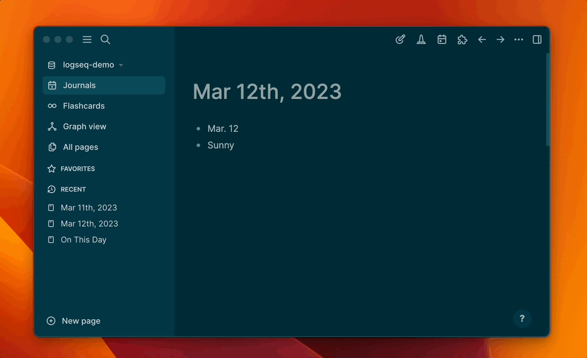

## logseq-on-this-day

Review previous journals on this day.

### Features

* List all journals created on this day in one page

### Demo

### How to use this plugin

1. Once the plugin is installed and enabled, you can click the plugin button on the top toolbar, find the "on-this-day" line and click it to pin its icon to the toolbar. 
2. Clicking the on-this-day monument button will generate the On This Day page if it doesn't exist, or refresh it if it exists.

**Warning**: Contents on the On This Day page will be removed every time.
- Please do not add new blocks to this page manually because they will be lost next time you generate this page.
- If you wish to revisit this page without regenerating the contents, you can save this page to Favorites for quick access. 

### Customize the plugin

On the plugin settings page, you can customize the following settings for this plugin by selecting Settings -> Plugins -> logseq-on-this-day.

* startingYear: Specify the starting year you wish to view on the On This Day page (till now). Journals before this year will be skipped.
* pageTitle: You can customize the page title. It's valid to use non-English characters. Warning: existing contents on this page will be removed every time.
* enableJump: Jump to previous day or next day on the On This Day page or a Journal page. When this option is enabled, you will see two addtional arrow buttons. Clicking an arrow button can jump to previous day or next day.
* jumpButtonPosition: Where to put the jump buttons? Since there could be many buttons on the toolbar, to prevent confusion, the arrow buttons are placed to the pagebar by default. You can change this setting to the toolbar. This settings is only valid when enableJump is selected.

### Recent Changes

0.0.3: add capability to jump to previous day or next day. Default off. Please enable manually in the settings page.